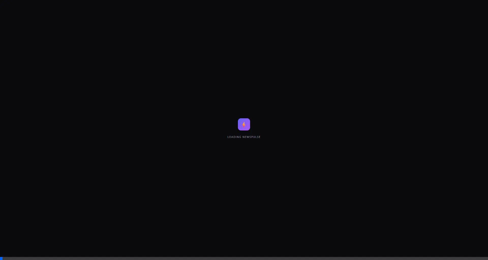
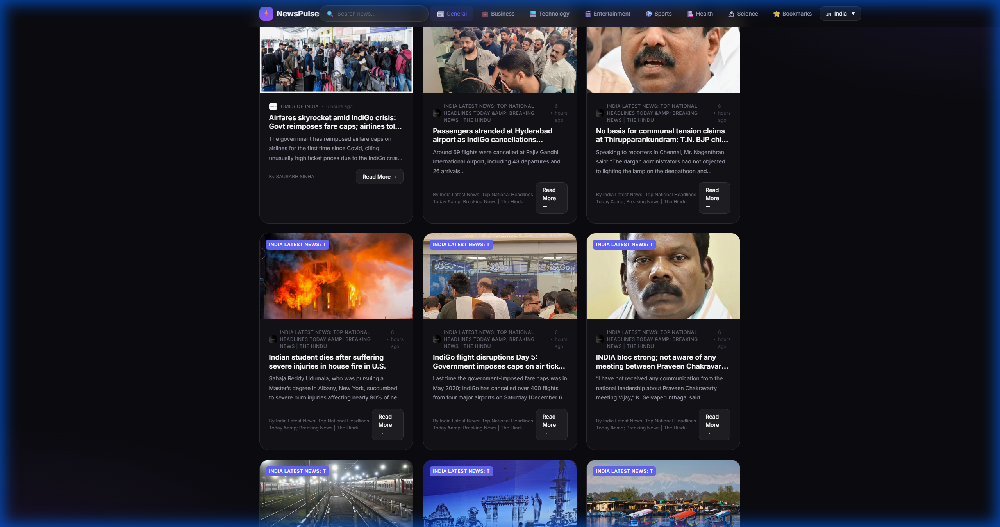
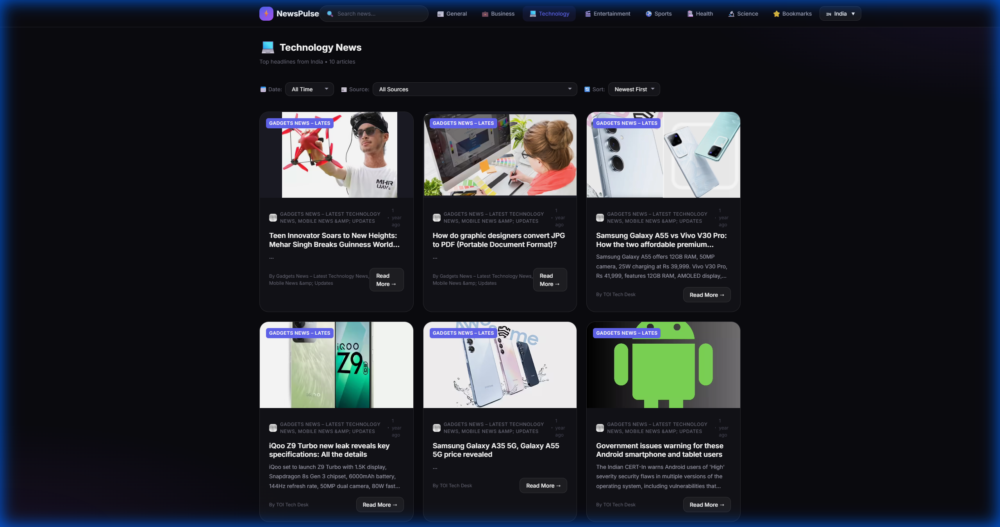
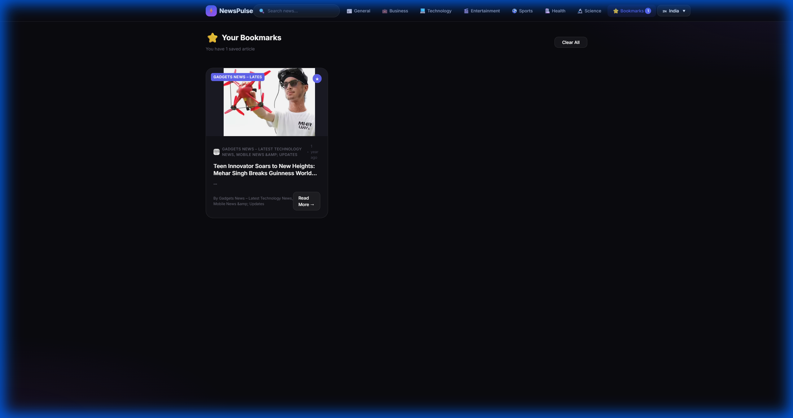

# ⚡ NewsPulse - Premium News Aggregator

A modern, feature-rich news aggregator built with React. Features a stunning glassmorphism dark theme, multi-country support, and **no API key required** - powered by free RSS feeds!


## 🎬 Demo



## 📸 Screenshots

### Home Page


### Technology News


### Bookmarks


## ✨ Features

### 🎨 Premium UI
- **Glassmorphism Design** - Beautiful semi-transparent cards with backdrop blur
- **Dark Theme** - Easy on the eyes with deep space colors
- **Smooth Animations** - Hover effects, loading skeletons, and micro-interactions
- **Responsive Layout** - Mobile-first design that works on all devices

### 🔍 Powerful Search
- Real-time search across all articles
- Search by title, description, or source
- Instant filtering as you type

### 🌍 Multi-Country Support
- **India** 🇮🇳 - Times of India, The Hindu, Economic Times
- **United States** 🇺🇸 - NY Times, NPR, Bloomberg
- **United Kingdom** 🇬🇧 - BBC, The Guardian
- **Australia** 🇦🇺 - ABC News, Sydney Morning Herald

### 📰 News Categories
- 📰 General
- 💼 Business
- 💻 Technology
- 🎬 Entertainment
- ⚽ Sports
- 🏥 Health
- 🔬 Science

### ⭐ Bookmarks
- Save articles to read later
- Persisted in localStorage
- Quick access from navbar

### 🎯 Advanced Filtering
- Filter by date (Today, This Week, This Month)
- Filter by source
- Sort by newest/oldest

### 📱 PWA Ready
- Installable on desktop and mobile
- App shortcuts for quick access

## 🚀 Getting Started

### Prerequisites
- Node.js 16+ 
- npm or yarn

### Installation

```bash
# Clone the repository
git clone https://github.com/yourusername/newspulse.git

# Navigate to project directory
cd newspulse

# Install dependencies
npm install

# Start development server
npm start
```

The app will open at [http://localhost:3000](http://localhost:3000)

### Build for Production

```bash
npm run build
```

## 🏗️ Project Structure

```
src/
├── components/
│   ├── NavBar.js          # Navigation with search & country selector
│   ├── News.js            # Main news feed with filtering
│   ├── NewsCard.js        # Premium article card component
│   ├── FilterBar.js       # Date, source, sort filters
│   ├── Spinner.js         # Skeleton loading component
│   ├── Bookmarks.js       # Saved articles page
│   └── Trending.js        # Top stories page
├── contexts/
│   ├── SearchContext.js   # Global search state
│   ├── BookmarkContext.js # Bookmark management
│   └── CountryContext.js  # Country selection
├── hooks/
│   └── useLocalStorage.js # localStorage persistence
├── services/
│   └── rssService.js      # RSS feed fetching & parsing
├── App.js                 # Main app with routing
├── index.js               # Entry point
└── index.css              # Complete design system
```

## 🎨 Design System

The app uses CSS custom properties for consistent theming:

```css
:root {
  /* Colors */
  --bg-primary: #0a0a0f;
  --accent-primary: #6366f1;
  --accent-secondary: #8b5cf6;
  
  /* Glassmorphism */
  --bg-glass: rgba(255, 255, 255, 0.05);
  --glass-blur: blur(20px);
  
  /* Typography */
  --font-sans: 'Inter', sans-serif;
}
```

## 🔌 API

NewsPulse uses **rss2json.com** to convert RSS feeds to JSON. This is completely free and requires no API key!

### Adding New Sources

Edit `src/services/rssService.js` to add new RSS feeds:

```javascript
const RSS_SOURCES = {
  countryCode: {
    name: 'Country Name',
    flag: '🏳️',
    feeds: {
      general: ['https://example.com/feed.rss'],
      business: ['https://example.com/business.rss'],
    }
  }
};
```

## 📦 Dependencies

- **React 18** - UI framework
- **React Router 6** - Client-side routing
- **rss2json API** - RSS to JSON conversion (free)

No paid APIs or external UI libraries required!

## 🤝 Contributing

Contributions are welcome! Please feel free to submit a Pull Request.

## 📄 License

This project is licensed under the MIT License.

---

<p align="center">
  Made with ❤️ and React
</p>
