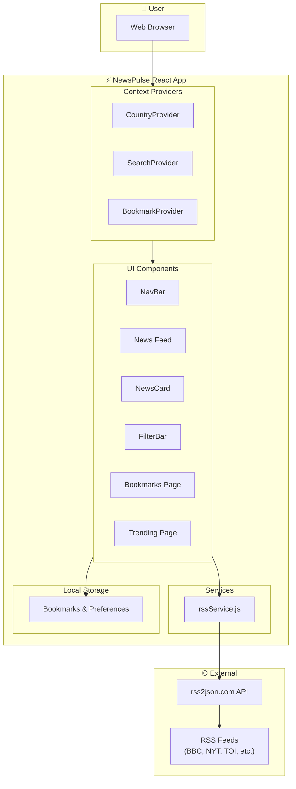
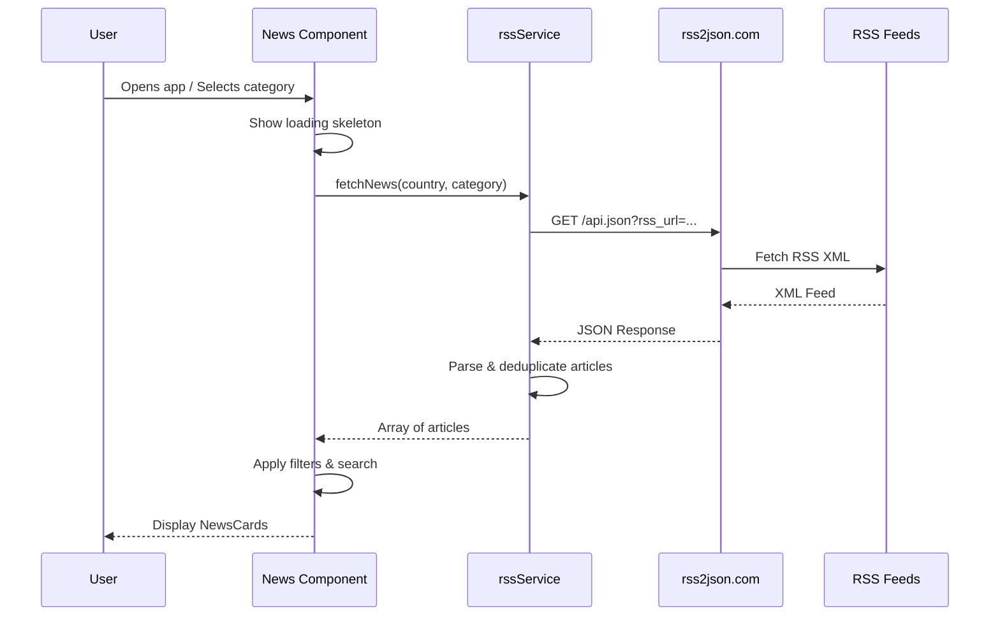
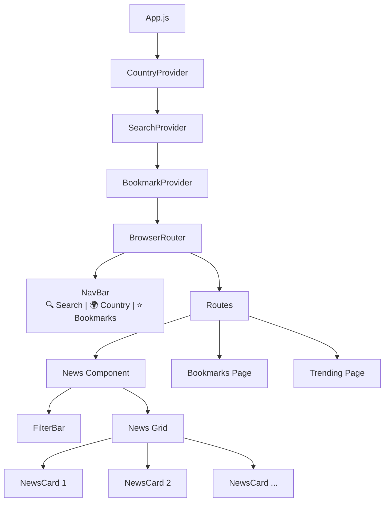
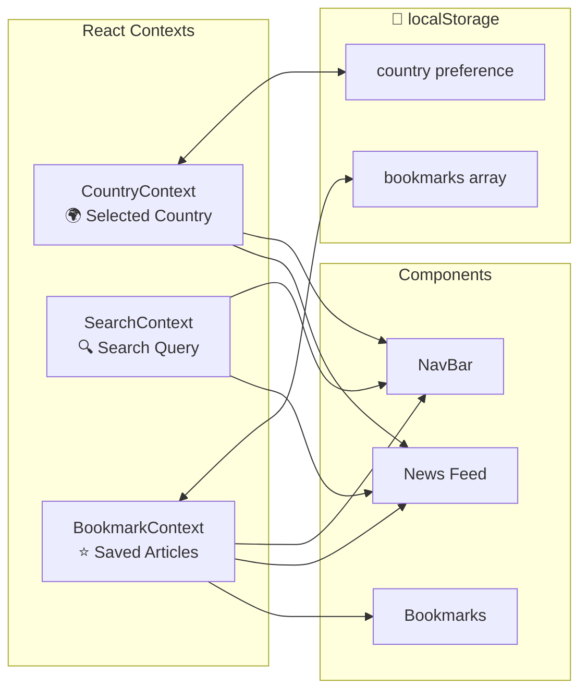
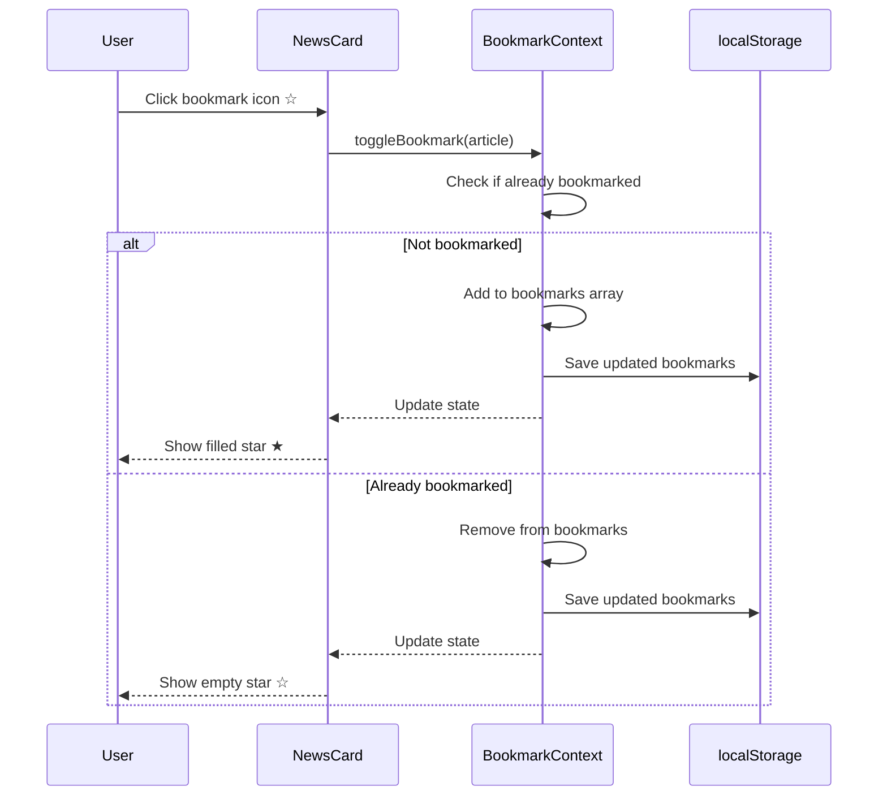
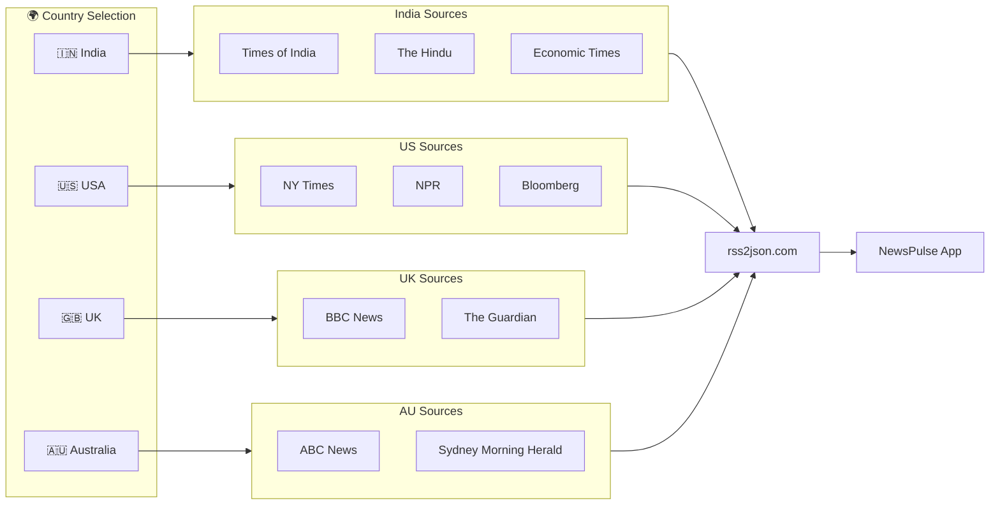
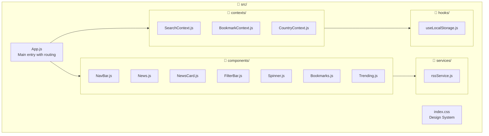

# NewsPulse - Architecture & Flow Diagram

This document explains how the NewsPulse app works step by step.

## Application Architecture

## Data Flow - Loading News

## Component Hierarchy

## State Management Flow

## Feature Workflow: Bookmarking an Article

## RSS Feed Sources

## File Structure Overview

---

## Summary

| Step | What Happens |
|------|--------------|
| 1️⃣ | User opens app → React renders with context providers |
| 2️⃣ | News component mounts → Calls `fetchNews()` from rssService |
| 3️⃣ | rssService → Calls rss2json.com API with RSS feed URLs |
| 4️⃣ | API converts RSS XML → JSON and returns articles |
| 5️⃣ | Articles are parsed, deduplicated, and sorted by date |
| 6️⃣ | User can search → SearchContext filters articles |
| 7️⃣ | User can bookmark → BookmarkContext saves to localStorage |
| 8️⃣ | User switches country → CountryContext updates, new RSS feeds loaded |
